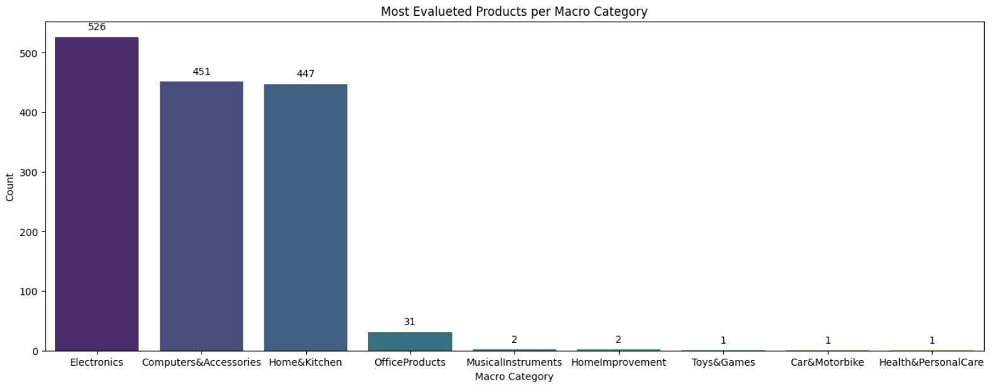
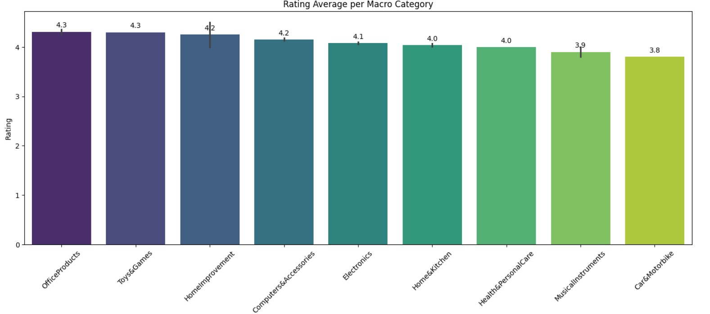
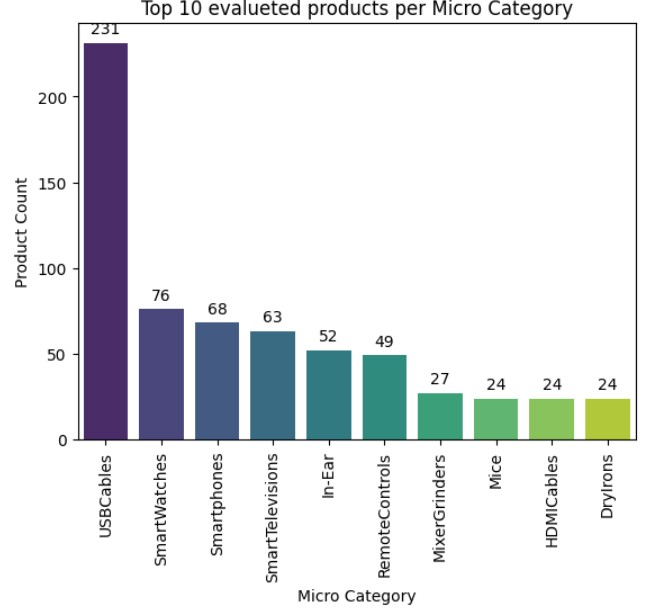

# Amazon Sales EDA Analysis


# Summary
This project performs an exploratory data analysis (EDA) on Amazon sales data, focusing on product reviews and their impact on sales performance. The analysis includes visualizations and statistical insights related to product categories, pricing, and customer ratings.

# Key Insights
1. The "Rating Histogram" graph shows that most of the reviews are between 4.0 and 4.5:


2. I created a column to categorize the rating numbers into rating descriptions in a particular way:
* 1 to 2 -> 'Terrible'
* 2 to 3 -> 'Poor'
* 3 to 4 -> 'Average'
* 4 to 5 -> 'Good'


3. I created a new column, "Macro Category" to identify the number of products evaluated per "Macro Category":


4. This graph shows the average rating per Macro Category, where we can see that the first three evaluated products  in the previous graph  ("Electronics", "Computers&Accessories" and "Home&Kitchen") have an average rating between 4.0 and 4.2. In addition, the two best-rated products ("OfficeProducts" and "Toys&Games" have only 31 and 1 evaluation, respectively:


5. I created a new column "Micro Category" to analyze the top 10 evaluated products per Micro Category:


# Technologies
- Python
- Pandas
- NumPy
- Matplotlib
- Seaborn
- Jupyter Notebook

# How to Run

1. Clone the repository:
   ```bash
   git clone https://github.com/felipe-lemos-costa/Amazon-Sales-EDA-Analysis.git
   ```

2. Install dependencies:
   ```bash
   pip install -r requirements.txt
   ```

3. Open and run the Jupyter Notebook:
   ```bash
   jupyter notebook Amazon-Sales-EDA-Analysis.ipynb
   ```

# License
This project is licensed under the MIT License - see the [LICENSE](LICENSE) file for details.
